# UZH Thesis Matchmaking Assistant

AI-powered system for discovering relevant thesis topics and supervisors at the **University of Zurich (UZH)**.

The system combines:

* ZORA publication data
* university thesis postings
* semantic search
* ranking algorithms
* large language models (LLMs)

to recommend suitable thesis opportunities based on a student's research interests.

---

# Project Motivation

At large universities, identifying relevant thesis opportunities and supervisors can be difficult because information is scattered across:

* research group websites
* departmental pages
* publication repositories

This project explores how **retrieval-augmented generation (RAG)** can help students discover relevant research opportunities.

---

# AI Buddy Context

The system is designed as a **modular service** that can potentially integrate with the **UZH AI Buddy** ecosystem.

## AI Buddy Architecture



---

# System Overview

High-level pipeline:

Student Query
→ Query Parser (LLM)
→ Semantic Retrieval over ZORA publications
→ Supervisor Ranking
→ Recommendation Generation

---

# Planned Features

* ingestion of **ZORA publication metadata**
* scraping **open thesis postings**
* **semantic search** using embeddings
* ranking of **potential supervisors**
* **LLM-generated recommendations**

---

# Repository Structure

```
uzh-thesis-matchmaking
│
├── README.md
│
├── docs/
│   └── architecture/
│       └── ai_buddy_architecture.svg
│
├── src/            # main source code
├── tests/          # unit tests
├── scripts/        # runnable scripts
├── configs/        # configuration files
└── notebooks/      # experimentation
```

---

# Setup (Planned)

```
pip install -r requirements.txt
```

---

# Example Query

```
I want to do a master's thesis in NLP related to retrieval-augmented generation.
```

Example output:

1. Prof. X – Natural Language Processing
2. Prof. Y – Information Retrieval
3. Prof. Z – Misinformation Detection

---

# Project Status

🚧 Early development phase.

---

# Contributors

* Shayan Sooratgar
* Nicolas Peyer
* Gregory Frommelt
* Ilya Kruchenetskiy
